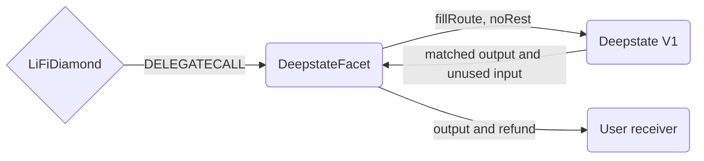

# Deepstate Facet

## How it works

The Deepstate Facet executes a bounded swap against the Deepstate V1 matching engine on Robinhood
Chain. Deepstate is an onchain order book: LI.FI submits concrete packed fill instructions to the
verified engine, each leg is matched onchain, and all state changes and token settlement occur
atomically in the same transaction.

This integration is therefore not an offchain RFQ, intent, or asynchronously settled limit-order
flow. A failed fill, insufficient balance, failed transfer, or unmet LI.FI minimum output reverts the
entire transaction.



## Deployment and backend dependencies

The initial verified Deepstate V1 engine deployment is on Robinhood Chain (chain ID 4663):

`0x6cf19308C22FC82ea620Fa0B3E94948d20f27B96`

The facet deployment binds this engine as an immutable constructor argument. Deepstate is
permissionless: binding the engine does not authorize a pair list. The facet does not hardcode pools
or tokens. The LI.FI backend can quote any active Deepstate market whose assets pass the
exact-transfer eligibility screen below and for which it can produce a valid packed order and epoch.

The engine and `fillRoute` selector must not be added to LI.FI's shared `LibAllowList`. That mapping
also authorizes calls made through generic swap facets, whose approval and calldata model is broader
than this integration's bounded accounting. Engine authorization is therefore private to the
Deepstate facet.

Deepstate's settlement accounting requires standard exact-balance ERC20 behavior. The LI.FI token
registry and quote backend must therefore deny an asset by default until it is confirmed not to be
fee-on-transfer, mint-on-transfer, rebasing, transfer-hooked, or otherwise balance-changing during a
transfer. Native currency is supported. This is an asset-behavior safety screen, not a pool or pair
allowlist: any permissionlessly created market composed entirely of eligible assets remains
quotable.

For each quote, the backend must:

- read current onchain roots and order nodes for the requested market;
- encode the taker's limit price and quantity into the packed `order` value;
- target the correct current or historical book `epoch`;
- set LI.FI's `_minAmountOut` from the quoted executable output; and
- submit only direct fills whose input and output match the declared LI.FI assets.
- reject a route if either asset is absent from the exact-transfer token registry.

The facet permits several legs for the same direct market and direction so a quote can consume
liquidity from more than one book epoch. It rejects legs that introduce another input or output
asset.

## Safety boundaries

- The facet can call only its immutable Deepstate engine. A different engine in caller-supplied swap
  data reverts.
- Deepstate's engine and `fillRoute` selector are deliberately absent from LI.FI's shared allowlist,
  so generic swap facets cannot invoke this route.
- The facet overwrites `noRest` to `true` on every leg. The LiFiDiamond can consume resting
  liquidity but cannot become a maker or leave collateral in Deepstate.
- ERC20 authority is an exact temporary allowance capped at `fromAmount` and cleared after the
  engine call.
- ERC20 deposits, engine input settlement, output delivery, and input refunds are checked against
  exact balance deltas. Non-standard movement reverts the complete transaction.
- Native input requires `msg.value == fromAmount`; unused input returned by Deepstate is still
  refunded to the receiver.
- Existing LiFiDiamond balances are excluded from output and refund accounting.
- LI.FI swap events report only the input consumed by Deepstate, excluding any unfilled input that
  is refunded to the receiver.
- Unspent input and realized output are delivered to the explicit receiver rather than
  `msg.sender`, which may be a relayer.
- `_minAmountOut` protects the complete call from stale or insufficient liquidity.
- The facet is reentrancy guarded, including native output and refund transfers.

The contract is not intended to retain user balances. Any assets held during execution are
transient; matched output and unused input are sent to the receiver before the call completes.

## Production activation checklist

Robinhood Chain skips the repository's generic post-deployment health check. The following
Deepstate-specific checks are therefore mandatory and must not be replaced by a successful deploy
transaction alone.

Before deployment and the facet cut:

- Run `bun test script/deploy/deepstateWhitelistIsolation.test.ts`. This prevents an engine in
  `config/deepstate.json` from being authorized through either shared-whitelist config surface.
- Run the Deepstate unit tests and the Robinhood fork tests against the intended release commit,
  using an archive-capable Robinhood RPC for the pinned fork block.
- Dry-run `DeployDeepstateFacet.s.sol` for Robinhood and confirm that its constructor argument is the
  engine recorded in `config/deepstate.json`.
- Confirm that the exact-transfer token registry and backend route construction described above are
  deployed. Do not enable quotes before both controls are active.

After deploying and cutting the facet into the production diamond:

- Confirm `facetAddress(0x116db7f5)` equals the newly deployed and source-verified Deepstate facet.
- Confirm `isContractSelectorWhitelisted(engine, 0xbe4c013e)` is `false` and
  `getWhitelistedSelectorsForContract(engine)` is empty. The values are the selectors for
  `swapTokensViaDeepstate` and `fillRoute`, respectively.
- Execute a minimum-size canary swap from a backend-generated quote. Confirm the receiver obtains
  the expected output and any unused input, the Diamond retains no route residue, and its allowance
  to the engine is zero after settlement.
- Re-run the two shared-whitelist reads after any whitelist sync affecting Robinhood. Never add the
  Deepstate engine as a DEX, periphery contract, or approve-only target.

Any failed check blocks quote activation and requires rollback of the Deepstate facet selector.

## Public method

`swapTokensViaDeepstate(bytes32,string,string,address,uint256,DeepstateSwapData)` deposits at most
`fromAmount`, forces every fill to `noRest`, executes the route, enforces `minAmountOut`, sends the
receiving asset to the receiver, and refunds unused input.

`DeepstateSwapData` contains:

```solidity
struct DeepstateSwapData {
    IDeepstateV1 deepstate;
    address sendingAssetId;
    address receivingAssetId;
    uint256 fromAmount;
    IDeepstateV1.FillParams[] fills;
}
```

Each `FillParams` contains the sorted token pair, book epoch, packed incoming order, side, and
execution flags. The caller-provided `noRest` value is ignored and replaced with `true`.
